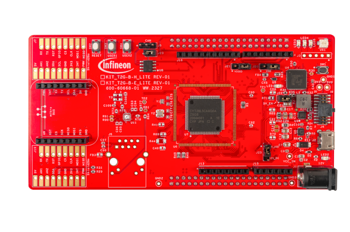

# KIT_T2G-B-E_LITE BSP

## Overview

The KIT_T2G-B-E_LITE, a 100-pin evaluation board is based on the TRAVEO™ T2G Body Entry family of devices. TRAVEO™ T2G Body Entry MCU is designed for  automotive and industrial applications. The evaluation board carries a TRAVEO™ T2G Body Entry microcontroller,and headers compatible with Arduino for interfacing Arduino shields. In addition, the board features an on-board programmer/debugger (KitProg3),  CAN FD transceiver, a Shield2Go connector interface and MikroBUS connector interface, three user LEDs, one potentiometer,  and two user push buttons. The board supports operating voltages from 3.3 V to 5.0 V for TRAVEO™ T2G Body Entry device.     
**Note:**
Some additional setups will allow you to use more code examples than those shown on the next page. Click 
[here ](https://github.com/Infineon/TRAVEO_T2G_code_examples#how-to-setup)
for setup instructions.

To use code from the BSP, simply include a reference to `cybsp.h`.

## Features

### Kit Features:

* CYT2BL5CAS 4MB Flash 100-pin LQFP device
* Programming interface (Arm® Standard JTAG, Cortex® Debug + ETM with Arm® ETM Mictor)
* Reset control with manual reset switch and voltage supervision
* CAN FD interface
* KitProg3 on-board SWD programmer/debugger, USB-UART and USB-I2C bridge functionality
* A Shield2Go connector interface and a MikroBUS connector interface
* Selectable input supply voltages of 3.3 V and 5.0 V for the TRAVEO™ T2G Body Entry device
* Three user LEDs, two user buttons, and a reset button for the TRAVEO™ T2G Body Entry device
* A potentiometer which can be used to simulate analog sensor output
* A mode button and a mode LED for KitProg3

### Kit Contents:

* TRAVEO™ T2G Body Entry evaluation board
* See 
[Quick start guide](https://www.infineon.com/dgdl/?fileId=8ac78c8c8929aa4d018990ed27ea5f31)

### Low-level Driver References:

* See 
[Hardware abstraction layer (HAL) library](https://infineon.github.io/mtb-hal-cat1/html/modules.html)
* See 
[Peripheral driver library (PDL) library](https://infineon.github.io/mtb-pdl-cat1/pdl_api_reference_manual/html/index.html)

## BSP Configuration

The BSP has a few hooks that allow its behavior to be configured. Some of these items are enabled by default while others must be explicitly enabled. Items enabled by default are specified in the KIT_T2G-B-E_LITE.mk file. The items that are enabled can be changed by creating a custom BSP or by editing the application makefile.

Components:
* Device specific category reference (e.g.: CAT1) - This component, enabled by default, pulls in any device specific code for this board.

Defines:
* CYBSP_WIFI_CAPABLE - This define, disabled by default, causes the BSP to initialize the interface to an onboard wireless chip if it has one.
* CY_USING_HAL - This define, enabled by default, specifies that the HAL is intended to be used by the application. This will cause the BSP to include the applicable header file and to initialize the system level drivers.
* CYBSP_CUSTOM_SYSCLK_PM_CALLBACK - This define, disabled by default, causes the BSP to skip registering its default SysClk Power Management callback, if any, and instead to invoke the application-defined function `cybsp_register_custom_sysclk_pm_callback` to register an application-specific callback.

### Clock Configuration

| Clock    | Source    | Output Frequency |
|----------|-----------|------------------|
| FLL      | IMO       | 100.0 MHz        |
| CLK_HF0  | CLK_PATH0 | 100 MHz          |
| CLK_HF1  | CLK_PATH1 | 8 MHz            |
| CLK_HF2  | CLK_PATH2 | 8 MHz            |

### Power Configuration

* System Idle Power Mode: Deep Sleep
* VDDA Voltage: 3300 mV
* VDDD Voltage: 3300 mV

See the [BSP Setttings][settings] for additional board specific configuration settings.

## API Reference Manual

The KIT_T2G-B-E_LITE Board Support Package provides a set of APIs to configure, initialize and use the board resources.

See the [BSP API Reference Manual][api] for the complete list of the provided interfaces.

## More information
* [KIT_T2G-B-E_LITE BSP API Reference Manual][api]
* [KIT_T2G-B-E_LITE Documentation](https://www.infineon.com/KIT_T2G-B-E_LITE)
* [Cypress Semiconductor, an Infineon Technologies Company](http://www.cypress.com)
* [Infineon GitHub](https://github.com/infineon)
* [ModusToolbox™](https://www.cypress.com/products/modustoolbox-software-environment)

[api]: https://infineon.github.io/TARGET_KIT_T2G-B-E_LITE/html/modules.html
[settings]: https://infineon.github.io/TARGET_KIT_T2G-B-E_LITE/html/md_bsp_settings.html

---
© Cypress Semiconductor Corporation (an Infineon company) or an affiliate of Cypress Semiconductor Corporation, 2019-2024.